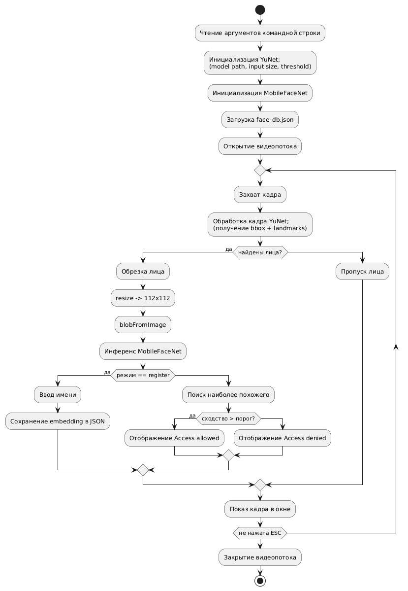

# Практическая работа в "Открытая мобильная работа"

## Задание

Нужно найти и реализовать легковесный вариант распознавания лица на C++.
Можно поискать готовые библиотеки, но желательно иметь минимум зависимостей.
Должно быть 2 режима:
- инициализация лица и сохранение в некую БД (файл)
- распознавание лица и поиск в базе сохраненных -> Результат true/false.
  В обоих режимах входные данные - видеопоток.

## Функционал проекта

Проект представляет собой легковесный вариант распознавания лиц в видеопотоке на С++.

В данном проекте реализовано два режима работы, определение режима работы происходит через аргументы командной строки:

### 1. Инициализация лица
    
Для режима регистрации лица реализован ниже представленный функцинонал: 

- Распознавание лица в видеопотоке
- Извлечение вектора признаков (embedding) с помощью MobileFaceNet
- Сохранение полученного вектора и данные пользователя в базу данных, на данном этапе JSON-файл

### 2. Распознавание лица

Для режима распознавания лица реализован ниже представленный функцинонал:

- Распознавание лица в видеопотоке
- Сравнивает полученный вектор признаков с базой данных
- В качестве результата выводит true/false ("Access denied" / "Access allowed").

## Назначение проекта

**Цель проекта** — реализация простой и производительной системы распознавания лиц на C++ с минимальными зависимостями.

- Внедрение в ОС АВРОРА
- Расширения для дальнейших проектов

## Использованные зависимости

- **OpenCV** - обработка видеопотока и запуск ONNX-моделей
- **nlohmann/json** - работа с JSON-базой данных
- **ONNX** - формат нейросетевых моделей:
  1. YuNet - модель детекции лиц
  2. MobileFaceNet - модель извлечения признаков

## Блок-схема алгоритма

## Структура проекта

## OpenCV
Licensed under Apache License 2.0
https://github.com/opencv/opencv/blob/4.x/LICENSE

## nlohmann/json
Licensed under MIT
https://github.com/nlohmann/json/blob/develop/LICENSE.MIT

## MobileFaceNet
Licensed under MIT 
https://github.com/foamliu/MobileFaceNet/blob/master/LICENSE
